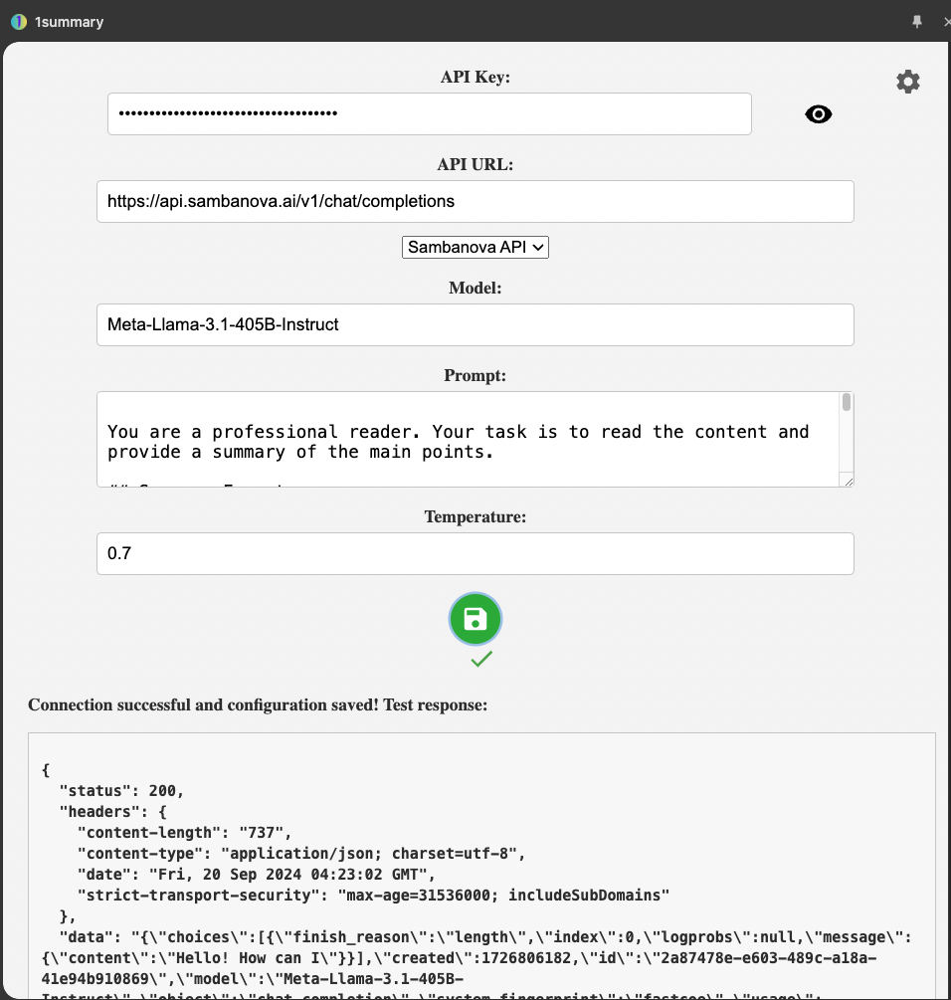

# OneSummary 浏览器扩展

<figure style="text-align: center">
    
</figure>

OneSummary

一个简洁的 chrome 插件，快速生成网页摘要

# 功能特点

- 一键生成网页摘要
- 支持自定义 API 设置（API 密钥、URL、模型、系统 prompt、模型温度）
- 支持生成结果保存及重新生成摘要
- 一键复制摘要内容
- 支持侧边栏展示
- 支持模型配置保存，方便切换

# 安装说明

1. 从 [GitHub Releases](https://github.com/ultrasev/1summary/releases) 下载最新版本的扩展包
2. 解压后打开 Chrome 浏览器，进入扩展管理页面（[chrome://extensions/](chrome://extensions/)）
3. 启用"开发者模式"
4. 点击"加载已解压的扩展程序"，选择包含扩展文件的文件夹

# 使用方法

1. 点击浏览器工具栏中的扩展图标打开弹出窗口
2. 首次使用时，点击设置图标进行必要的配置：
   - 输入您的 API 密钥
   - 设置 API URL
   - 选择要使用的 AI 模型
   - 自定义 prompt（可选）
   - 调整温度参数（可选）
3. 点击 "Test & Save" 按钮测试 API 连接
4. 配置完成后，点击扩展图标会自动生成当前页面的摘要
5. 使用 "Regenerate" 按钮可以重新生成摘要
6. 使用 "Copy" 按钮可以复制生成的摘要

注：以上配置信息保存到浏览器本地，不会上传到任何服务器，参考 [popup.js](./onesummary/popup.js) 文件中 `StorageManager` 类的实现。

## 关于 API endpoints

目前主要支持兼容 OpenAI 规范的 API，比如：`groq`、`deepseek`，有其他需求可以使用第三方工具（比如 [pro-api](https://github.com/duolabmeng6/pro-api)）进行转换，github 上有很多这样现成的库。
如果不想使用第三方工具，也可以参考 [models.js](./onesummary/models.js) 文件的实现方式，添加新的 API 实现。

## demo

<table>
  <tr>
    <td></td>
    <td></td>
  </tr>
</table>

# 注意事项

- 请妥善保管您的 API 密钥，不要与他人分享
- 本扩展需要访问当前标签页的内容权限才能正常工作
- 某些网站可能会限制内容提取，可能会影响摘要生成

# 贡献

目前结合 Groq、Sambanova 的免费 Llama 3.1 405B 模型，基本上可以满足日常需求。后面如果有必要、有时间会继续完善，同时也欢迎感兴趣的朋友提交 PR，有问题和改进建议请提 issue。

## TODO

- [x] 侧边栏展示
- [ ] 局部摘要

# 许可证

MIT
